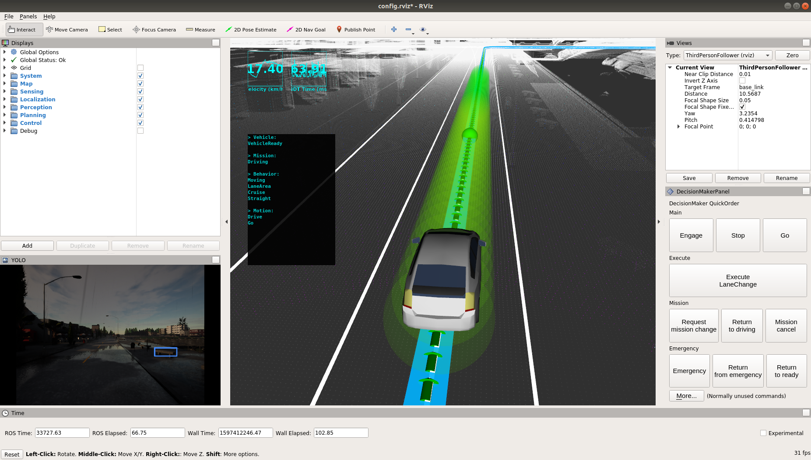

# Autoware 与Carla环境搭建
## 硬件环境
* 操作系统：Ubuntu 18.04.4 LTS
* 内存要求: 最少16G，推荐32G
* 显卡要求: 支持nvidia系列，最少 4G 显存

**注：本文使用了两台PC，一台用于运行autoware(IP: 172.16.202.234)，一台用于运行carla(IP: 172.16.202.235)**

## 软件环境
由于软件很多依赖资源都在国外的服务器上，国内下载很慢，因此遇到网络问题首先要想到有没有国内的源可以替换或者使用移动热点，可以加速，下面列出几种可能用得到的国内的源：

* [Ubuntu 18.04.4 apt 清华源](https://mirror.tuna.tsinghua.edu.cn/help/ubuntu/)

	将 /etc/apt/sources.list 内容替换为:
``` bash
# 默认注释了源码镜像以提高 apt update 速度，如有需要可自行取消注释
deb https://mirrors.tuna.tsinghua.edu.cn/ubuntu/ bionic main restricted universe multiverse
# deb-src https://mirrors.tuna.tsinghua.edu.cn/ubuntu/ bionic main restricted universe multiverse
deb https://mirrors.tuna.tsinghua.edu.cn/ubuntu/ bionic-updates main restricted universe multiverse
# deb-src https://mirrors.tuna.tsinghua.edu.cn/ubuntu/ bionic-updates main restricted universe multiverse
deb https://mirrors.tuna.tsinghua.edu.cn/ubuntu/ bionic-backports main restricted universe multiverse
# deb-src https://mirrors.tuna.tsinghua.edu.cn/ubuntu/ bionic-backports main restricted universe multiverse
deb https://mirrors.tuna.tsinghua.edu.cn/ubuntu/ bionic-security main restricted universe multiverse
# deb-src https://mirrors.tuna.tsinghua.edu.cn/ubuntu/ bionic-security main restricted universe multiverse
# 预发布软件源，不建议启用
# deb https://mirrors.tuna.tsinghua.edu.cn/ubuntu/ bionic-proposed main restricted universe multiverse
# deb-src https://mirrors.tuna.tsinghua.edu.cn/ubuntu/ bionic-proposed main restricted universe multiverse
```

* [pip 清华源](https://mirrors.tuna.tsinghua.edu.cn/help/pypi/)
	
	使用加速的例子：
```
pip install -i https://pypi.tuna.tsinghua.edu.cn/simple some-package
```	

* [docker镜像加速](https://www.runoob.com/docker/docker-mirror-acceleration.html)
* github 镜像加速

	github有时候clone过程很慢，可以尝试用以下方式：
```bash
## 原来的
git clone --recurse-submodules https://github.com/carla-simulator/carla-autoware
# 改为
git clone --recurse-submodules https://github.com.cnpmjs.org/carla-simulator/carla-autoware
```

### 1. 安装Carla（IP:172.16.202.235)
有多种方式可以[安装Carla](https://carla.readthedocs.io/en/latest/build_linux/#requirements)，推荐直接下载二进制程序，参考[这里](https://github.com/carla-simulator/carla/blob/master/Docs/download.md).

为了保证和后面的一系列环境兼容，最好下载本文实验成功的版本：[0.9.10_pre_release](https://carla-releases.s3.eu-west-3.amazonaws.com/Linux/CARLA_0.9.10-Pre_Ubuntu18.tar.gz)， 完成后解压到: **~/CARLA_0.9.10_pre_release**, 然后设置以下环境变量：

```bash
# 这个环境变量跟Carla客户端服务端通信连接有关，如果不配置，会有 cannot import module 'Carla' 之类的错误
export PYTHONPATH=$PYTHONPATH:~/CARLA_0.9.10_pre_release/PythonAPI/carla/dist/carla-0.9.10-py2.7-linux-x86_64.eggz:~/CARLA_0.9.10_pre_release/PythonAPI/carla/
```
完成以后可以尝试运行Carla：
```bash
cd ~/CARLA_0.9.10_pre_release
# 可以不加SDL_VIDEODRIVER参数，这个参数使得carla不显示界面
SDL_VIDEODRIVER=offscreen ./CarlaUE4.sh -opengl

```
再打开一个新窗口，尝试运行一个示例:
```bash
# 安装python依赖
pip install -i https://pypi.tuna.tsinghua.edu.cn/simple pygame networkx
cd ~/CARLA_0.9.10_pre_release/PythonAPI/examples
./automatic_control.py

```


### 2. 安装Docker 及 python, pip(IP: 172.16.202.234)

``` bash
sudo update
sudo apt install docker.io
sudo apt install python
sudo apt install python-pip

```

由于默认docker命令需要sudo执行，和后面的一些操作要求有冲突，因此推荐将当前用户加入docker用户组：

``` bash
# 建立docker用户组，如果存在可以略过
sudo groupadd docker

# 将当前用户添加到docker组
sudo gpasswd -a ${USER} docker

# 重启docker服务
sudo systemctl restart docker

## 更改docker配置文件权限
sudo chown "$USER":"$USER" /home/"$USER"/.docker -R
sudo chmod g+rwx "/home/$USER/.docker" -R
```

### 3. 安装Autoware集成环境

由于Autoware和carla集成需要安装较多的组件，为了将这些环境封装起来，本文使用了了docker的方式，封装了相关依赖，这些依赖包括：

* Autoware：用于感知/规划/控制算法
* ROS：机器人操作系统/实时通讯框架/通讯协议
* ROS Bridge-用于autoware与calar之间的通讯
* Carla-Autoware：封装了ros bridge，并提供了一个与autoware集成的示例（用代码封装了autoware的设置过程）

为了更好的理解这些组件的关系，下图可作为一个参考：


#### 3.1 Autoware Docker安装

``` bash
# 这个可能需要较长时间，注意换成国内的docker镜像源
docker pull autoware/autoware:1.14.0-melodic-cuda
git clone https://github.com/charles-lei/carla-autoware.git
cd carla-autoware
# 此命令会构建Autoware本地镜像carla-autoware:latest, 由于网络原因可能会很漫长或者容易失败，因此建议参考carla-autoware/Dockerfile 文件自行构建
./build.sh
```

#### 3.2 Autoware Docker运行
```bash
# 运行Autoware集成环境, 此命令会使用gpu，需要安装nvidia-docker可参考https://github.com/NVIDIA/nvidia-docker
./run.sh
```

### 4. 运行效果
在容器中运行命令：
```
roslaunch carla_autoware_agent carla_autoware_agent.launch town:=Town01 host:=172.16.202.235
```



### 5. 遗留问题
Autoware和Carla可以集成起来，在docker中生成的车辆，在carla可以看到，且地图可以同步，但目前车辆还不能自动规划，这个问题应当是carla-autoware最近更新导致的，目前还没找到问题的根源，这些问题在github上也暂未解决，可能需要切换到较低版本，可参考 [issue1](https://github.com/carla-simulator/carla-autoware/issues/88), [issue2](https://github.com/carla-simulator/carla-autoware/issues/84), 此问题解决后会更新此文档。

